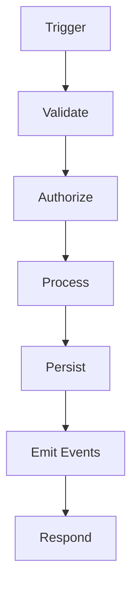

# APAP Template: Process Builder Diagram

Purpose: Model backend/service flows as clear, testable steps.

## Context
- Pattern: CQRS | Event-driven | REST
- Services involved:

## Flow Definition


## Steps
- Validate: rules, errors
- Authorize: roles, scopes
- Process: core logic
- Persist: transactions, retries
- Emit: topics, payloads
- Respond: status, body

## Failure Modes
- Timeouts
- Partial writes
- Idempotency

## Observability
- Logs, metrics, traces

## Ready-to-Generate Prompt
```
Goal: Implement <service flow>
Framework: <tech>
Steps: validate→authorize→process→persist→emit→respond
Contracts: <schemas/APIs>
Tests: unit for logic, integration for IO, e2e for journey
```