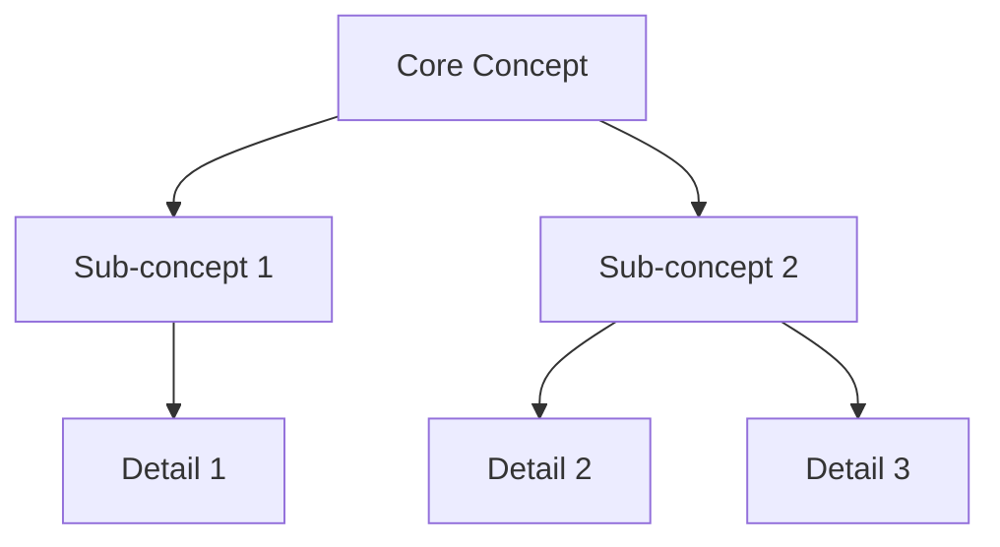

# Semantic Layer Map

**Project:** [Project Name]  
**Version:** [X.Y]  
**Last Updated:** [YYYY-MM-DD]  
**Maintained By:** [Team/Role]

---

## Purpose

Document the canonical vocabulary and concept relationships across the product to ensure semantic consistency and reduce cognitive load from terminology confusion.

---

## Core Concepts Registry

### Concept: [Concept Name]

**Canonical Term:** [The official term to use everywhere]

**Definition:** [Clear, unambiguous definition]

**Synonyms/Variations (DO NOT USE):**
- ❌ [Variation 1] — Found in: [Where used]
- ❌ [Variation 2] — Found in: [Where used]

**Usage Contexts:**
- **User-facing UI:** [Exact label/term]
- **API/Backend:** [Exact identifier]
- **Code Variables:** [Naming convention]
- **Documentation:** [Standard phrasing]
- **Support/Help:** [How explained to users]

**Related Concepts:**
- [Related concept] — Relationship: [Parent/Child/Sibling/Depends on]

**Examples:**
- Correct: "[Example sentence with canonical term]"
- Incorrect: "[Example with non-canonical term]" ← Should be: "[Corrected]"

**Visual Representation:**
[Icon, color, or visual pattern associated with this concept]

---

### Concept: [Concept Name]

[Repeat structure above for each core concept]

---

## Semantic Consistency Audit

| Concept | Canonical Term | UI Consistency | API Consistency | Code Consistency | Docs Consistency | Overall Status |
|---------|----------------|----------------|-----------------|------------------|------------------|----------------|
| [Concept] | [Term] | ✅ Yes / ⚠️ Partial / ❌ No | ✅/⚠️/❌ | ✅/⚠️/❌ | ✅/⚠️/❌ | 🟢/🟡/🔴 |

---

## Terminology Conflicts

### Active Conflicts (Blocking)

**Conflict 1: [Description]**
- **Terms in Conflict:** [Term A] vs [Term B]
- **Where Found:** [List all locations]
- **Impact:** [User confusion, support tickets, dev misunderstanding]
- **Resolution:** Use [Canonical term]
- **Remediation Plan:**
  - [ ] Update UI: [Specific screens]
  - [ ] Update API: [Specific endpoints]
  - [ ] Update Code: [Specific modules]
  - [ ] Update Docs: [Specific sections]
- **Owner:** [Name]
- **Due Date:** [Date]

### Historical Conflicts (Resolved)

**Conflict:** [Description]  
**Resolution:** [How resolved]  
**Resolved Date:** [Date]  
**Lessons Learned:** [What to avoid in future]

---

## Concept Hierarchy

```
Product Domain
├── Core Concept 1
│   ├── Sub-concept 1.1
│   └── Sub-concept 1.2
├── Core Concept 2
│   ├── Sub-concept 2.1
│   ├── Sub-concept 2.2
│   └── Sub-concept 2.3
└── Core Concept 3
    └── Sub-concept 3.1
```

**Hierarchical Relationships:**
- [Child concept] IS-A [Parent concept]
- [Concept A] HAS-A [Concept B]
- [Concept A] DEPENDS-ON [Concept B]

---

## Domain Language Rules

### Naming Conventions

**UI Labels:**
- Title Case for buttons and headings
- Sentence case for body text
- [Other conventions]

**API Identifiers:**
- camelCase for JSON properties
- snake_case for endpoints
- [Other conventions]

**Code Variables:**
- [Language-specific conventions]
- [Prefix/suffix patterns]

**Database Schema:**
- [Naming conventions]

### Forbidden Terms

| Forbidden Term | Reason | Use Instead |
|----------------|--------|-------------|
| [Term] | [Why it's confusing/ambiguous] | [Canonical term] |

### Approved Abbreviations

| Abbreviation | Full Term | Contexts Where Allowed |
|--------------|-----------|------------------------|
| [Abbr] | [Full term] | [UI/Code/Docs/All] |

---

## Concept Relationships Map

**Visual Map:** [Link to diagram or embed Mermaid]



**Relationship Table:**

| Concept A | Relationship | Concept B | Notes |
|-----------|--------------|-----------|-------|
| [Concept] | contains | [Concept] | [Context] |
| [Concept] | requires | [Concept] | [Context] |
| [Concept] | extends | [Concept] | [Context] |

---

## User Mental Model Alignment

### Expected User Vocabulary

**User Segment:** [Segment name]

**Terms They Bring:**
- [Term users are familiar with from their domain]
- [Term from competitor products]

**Our Mapping:**
- Their "[term]" = Our "[canonical term]"

**Onboarding Strategy:**
- [How we introduce our terminology]
- [Where we provide tooltips/definitions]

---

### Mental Model Gaps

**Gap:** [Description of mismatch between user expectation and our model]
- **Evidence:** [User research, support tickets]
- **Impact:** [Cognitive load increase, errors]
- **Mitigation:** [Terminology adjustment, onboarding, help text]

---

## API Semantic Contract

### Endpoint Naming Consistency

| Resource | Collection Endpoint | Single Resource | Action Endpoints | Consistency Status |
|----------|-------------------|-----------------|------------------|-------------------|
| [Resource] | /[plural] | /[plural]/:id | /[plural]/:id/[action] | ✅/⚠️/❌ |

### Response Schema Consistency

**Standard Fields Across All Resources:**
```json
{
  "id": "string (UUID)",
  "createdAt": "ISO-8601 timestamp",
  "updatedAt": "ISO-8601 timestamp",
  "status": "enum [active, inactive, pending]"
}
```

**Field Naming Patterns:**
- Booleans: `is[Adjective]`, `has[Noun]`
- Timestamps: `[event]At`
- Collections: `[noun]s` (plural)

---

## Documentation Standards

### Glossary Template

**Term:** [Canonical term]  
**Category:** [Domain area]  
**Definition:** [Clear definition]  
**Usage:** [How and where it's used]  
**Related:** [Links to related terms]  
**Examples:** [Practical examples]

### Help Text Standards

**Tooltip Format:**
```
[Canonical term]: [Brief definition] [Example]
```

**Inline Help:**
```
This [canonical term] allows you to [capability]. [Link to full documentation]
```

---

## Governance

### Semantic Change Process

**Minor Changes (Term refinement within concept):**
1. Propose change
2. Update Semantic Layer Map
3. Implement in next release

**Major Changes (Concept restructure, new canonical term):**
1. Propose with justification
2. Review with [Committee/Team]
3. Document migration plan
4. Deprecation timeline for old terms
5. Update all layers (UI/API/Code/Docs)

### Review Cadence

- **Weekly:** New terms added to registry
- **Monthly:** Consistency audit across active development
- **Quarterly:** Full semantic map review and conflicts resolution

---

## Consistency Checklist (Pre-Release)

- [ ] All new UI labels use canonical terms
- [ ] API endpoints follow naming conventions
- [ ] Code variables match semantic standards
- [ ] Help text and documentation updated
- [ ] No forbidden terms introduced
- [ ] Semantic Layer Map updated with new concepts

---

## Metrics

| Metric | Target | Current | Status |
|--------|--------|---------|--------|
| Semantic Consistency Score | ≥95% | [%] | 🟢/🟡/🔴 |
| Open Terminology Conflicts | 0 | [#] | 🟢/🟡/🔴 |
| Concepts with Variations | ≤5% | [%] | 🟢/🟡/🔴 |
| User Confusion (Support Tickets) | ≤[X] per month | [#] | 🟢/🟡/🔴 |

---

**TRACE:** L4:CognitiveLoad:Semantic  
**Cross-ref:** Experience DNA (L1), User DNA (L1), Cognitive Load Audit, Naming Consistency Registry
