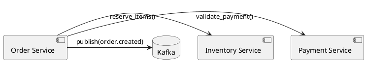

# Chapter 21: Governance by Artifacts

**TRACE:** `SCRIPT:PART5:CH21:v1.0`

---

Priya, the CTO at MediTech (a medical device software company with 60 engineers), sat in the FDA pre-submission meeting with growing dread. The auditor asked: **"Can you show me the traceability matrix linking User Requirements to Design Specifications to Test Cases?"**

Priya's team had built an excellent product—clinically validated, user-loved, technically sound. But the documentation was scattered: requirements in JIRA, design decisions in Slack threads, architecture rationale in engineers' heads, test plans in Google Docs. **No single source of truth. No traceability.**

The auditor's verdict: **"This submission will likely be delayed. Failure to maintain traceability or provide complete validation documentation is one of the most frequent causes of FDA submission delays or rejections"** (1).

Six months later—six months of lost market opportunity—MediTech resubmitted with a **Design History File (DHF)** that provided **"a historical record that facilitates traceability, transparency, and accountability throughout the product lifecycle"** (2). They passed.

Priya's lesson: **Governance isn't process—it's artifacts**. You can't govern what you can't trace. And you can't trace what isn't documented.

---

## The Artifact Thesis: Documentation as Governance

Most organizations treat governance as **meetings and approvals**—architecture review boards, steering committees, gate reviews. But **governance by committee** is slow, political, and fragile. When decisions live in meeting minutes and email threads, they're:

- **Invisible**: New team members can't discover past decisions
- **Immutable**: Can't be version-controlled or searched
- **Context-free**: Missing the "why" behind the "what"
- **Unenforceable**: No automated way to validate compliance

**Governance by Artifacts** inverts this: **Decisions manifest as living documents**—Architecture Decision Records (ADRs), Design History Files, traceability matrices, compliance evidence—that are:

- **Visible**: Version-controlled, searchable, discoverable
- **Mutable**: Evolve with codebase, never stale
- **Context-rich**: Capture reasoning, alternatives, trade-offs
- **Enforceable**: Automated checks validate compliance

**The shift**: From "did we have the meeting?" to **"does the artifact exist and satisfy requirements?"**

---

## Architecture Decision Records (ADRs): Lightweight Decision Documentation

**ADRs** (Architecture Decision Records) capture **why** architectural decisions were made—the context, alternatives considered, and consequences accepted.

### Origin and Adoption

- **2011**: Michael Nygard published "Documenting Architecture Decisions" (3)
- **2024**: **Thoughtworks Technology Radar categorizes ADRs as "Adopt"** (recommended for widespread use) (4)
- **October 11, 2024**: **Azure Well-Architected Framework published ADR guidance** (5)
- **Adoption timeline**: Teams typically see results within **6 months to 2 years** of implementation (4)

### ADR Structure (Nygard Template)

```markdown
# ADR-001: Use Event Sourcing for Order Processing

**Date**: 2024-11-15
**Status**: Accepted (supersedes ADR-000)

## Context
Our current CRUD approach to order processing makes it difficult to:
- Audit order state changes for compliance
- Replay orders for debugging production incidents
- Build analytics on order lifecycle

We process 50K orders/day; this will grow to 200K within 18 months.

## Decision
We will implement Event Sourcing for the Order domain using Kafka as event store.

## Alternatives Considered
1. **Traditional audit logging**: Rejected—doesn't enable replay or analytics
2. **Change Data Capture (CDC)**: Rejected—adds database dependency, complex setup
3. **Event Sourcing**: Chosen—native auditability, replay, analytics foundation

## Consequences
**Positive**:
- Complete audit trail for compliance (FDA traceability requirement)
- Production debugging via event replay
- Analytics query events without impacting operational DB

**Negative**:
- Learning curve for engineers (new pattern)
- Event schema evolution requires care (versioning)
- Storage grows (though Kafka compaction helps)

**Trade-offs**:
- Complexity today for flexibility tomorrow
- Accepting eventual consistency (order view may lag by ~100ms)
```

### The Immutability Principle

**ADRs are immutable records**—superseded decisions are marked as deprecated, **not deleted** (4). This preserves **decision history**: "Why did we choose X in 2022? Oh, because Y was true then. Now Z is true, so we're superseding with ADR-015."

### Why ADRs Work

1. **Lightweight**: Not a 50-page design document; a 1-page decision record
2. **Version-controlled**: Lives in `docs/adr/` alongside code; Git tracks evolution
3. **Searchable**: `grep -r "Kafka" docs/adr/` finds all Kafka-related decisions
4. **Onboarding tool**: New engineers read ADRs to understand "why we built it this way"
5. **Prevents repeated debates**: "We already decided this in ADR-008; here's why"

---

## Documentation as Code (Docs-as-Code): Treating Docs Like Software

**Docs-as-Code** applies software engineering rigor to documentation: version control, CI/CD, automated testing, pull request reviews (6).

### 2024 Best Practices

1. **Version Control Integration (Git)**:
   - Docs live in `docs/` directory alongside code
   - Markdown or reStructuredText (plain text, diff-able)
   - Versioning tied to software releases (docs/v2.3/, docs/v2.4/)

2. **CI/CD Pipeline Automation**:
   - **Link checking**: Broken links fail CI build
   - **Spelling/grammar checks**: Vale, write-good linters
   - **Diagram generation**: PlantUML, Mermaid auto-render
   - **Deployment**: Merge to main → auto-publish to docs site

3. **Pull Request Reviews**:
   - Docs changes reviewed like code changes
   - Reviewers check accuracy, clarity, completeness
   - No merge without docs update (for features/APIs)

4. **Automated Testing**:
   - Code snippets in docs are executed and validated
   - API examples tested against actual API
   - Tutorial steps verified in CI

### Popular Tools (2024)

- **Sphinx** (Python): Integrates with ReadTheDocs, auto-generates from docstrings (7)
- **MkDocs** (Markdown): Simple config, fast builds, Material theme popular (8)
- **Docusaurus** (React): Facebook's framework, modern docs sites (9)
- **Hugo** (Go): Fast static site generator, technical docs focus (6)
- **Jekyll** (Ruby): Powers GitHub Pages, extensive plugin ecosystem (6)

---

## Living Documentation: Docs That Evolve With Code

**Living Documentation** (Cyrille Martraire) goes beyond Docs-as-Code: **documentation auto-generates from code**, ensuring it's **always current** (10).

### Three Mechanisms

#### 1. Code Annotations Generate Documentation

```python
@api_endpoint(
    method="POST",
    path="/api/v1/orders",
    description="Create a new order",
    request_schema=OrderCreateRequest,
    response_schema=OrderCreateResponse,
    latency_budget_p95="200ms"
)
def create_order(request: OrderCreateRequest) -> OrderCreateResponse:
    """
    Creates a new order and publishes order.created event.

    Validates payment method, checks inventory, reserves items.
    """
    # Implementation
```

**Auto-generated docs** (via Swagger/OpenAPI):
- API endpoint reference
- Request/response schemas
- Performance budget (SLA)
- Implementation logic summary

#### 2. Tests as Documentation (BDD/Gherkin)

```gherkin
Feature: Order Creation
  As a customer
  I want to create an order
  So that I can purchase products

  Scenario: Successful order creation
    Given I have a valid payment method
    And the product "Widget" is in stock (quantity: 5)
    When I create an order for 2 "Widgets"
    Then the order status should be "pending"
    And my inventory reservation should be 2 "Widgets"
    And an "order.created" event should be published
```

**These tests execute** and **serve as living documentation** of system behavior.

#### 3. Architecture Diagrams Auto-Generated

**PlantUML** or **Mermaid** diagrams in code:



**Diagram renders in docs**, tied to code. When service relationships change, diagram changes.

### The ROI: Dropbox's 340% Return

**Dropbox** implemented living documentation and achieved **340% ROI** (11):
- **Freshness guaranteed**: Docs can't become stale (tied to code)
- **Reduced maintenance**: Auto-generation eliminates manual updates
- **Increased trust**: Developers trust docs because they're current
- **Faster onboarding**: New engineers ramp faster with accurate docs

---

## Knowledge Management: Capturing Tribal Knowledge

**Tribal knowledge**—information living in individuals' heads—is organizational fragility. When that person leaves or goes on vacation, the knowledge leaves (12).

### 2024 AI-Powered Knowledge Capture Tools

Modern tools use AI to **proactively capture knowledge**:

1. **Tettra** (with AI Assistant "Kai"):
   - Automatically suggests content updates based on usage patterns
   - Identifies documentation gaps by analyzing questions
   - Prompts for documentation at key moments (13)

2. **Augmentir** (with AI Assistant "Augie"):
   - Voice/video/text instructions captured on-the-job
   - Mobile-first for frontline workers
   - Generative AI assists in real-time (14)

3. **ScreenSteps**:
   - Knowledge ops platform adding training features
   - Step-by-step workflow capture
   - Training integration for knowledge transfer (15)

4. **FAT FINGER**:
   - Drag-and-drop builder for SOPs
   - Mobile app for on-the-job documentation
   - Workflow digitization (16)

### The Capture Paradox

**"The best way to capture tribal knowledge is with a knowledge management tool—software that helps document procedural knowledge and makes it easy to capture and share with teams"** (15).

But tools fail without **culture**. Knowledge capture requires:
- **Incentives**: Reward documentation contributions
- **Prompts**: AI assistants that ask "Should we document this?"
- **Ease**: Mobile apps, voice capture, templates reduce friction
- **Discoverability**: Central repository, search, tagging

---

## Regulatory Compliance: Traceability as Governance

For regulated industries (medical devices, food safety, financial services), **traceability isn't optional—it's law**.

### FDA Medical Device Software

**"Failure to maintain traceability or provide complete validation documentation is one of the most frequent causes of FDA submission delays or rejections"** (1).

**Requirements**:
- **Traceability matrices**: User Requirements → Design Specs → Implementation → Tests
- **Design History File (DHF)**: Historical record for traceability, transparency, accountability (2)
- **Risk-based documentation**: June 14, 2023 FDA guidance shifted from **3-tier to 2-tier documentation levels based on risk** (17)

**Tools**: Ketryx offers FDA/EU MDR/ISO compliance with automated ALM (Application Lifecycle Management) (18).

### FSMA Food Safety Traceability

**Case Study: FreshMeals Foods** (hypothetical, based on research patterns):
- **Challenge**: Manual FSMA Hazard Analysis, limited traceability, compliance risk
- **Solution**: Implemented QMS software
  - Digitized manufacturing process tracking
  - Automated supplier audit workflows
  - Customer complaint investigation system
  - Digital Hazard Analysis and CCP monitoring
- **Outcome**: **2025 FDA audit: Zero findings** (19)

### SOC 2 Compliance

**"The average SOC 2 audit has over 200 security requirements to implement"** (20).

**Evidence types**:
- **Employee-related**: Onboarding/offboarding, background checks
- **Risk management**: Documentation, policies, procedures
- **Security controls**: Access logs, monitoring, incident response

**Audit rigor**: **"A SOC 2 Type 2 is a much more rigorous compliance audit that requires in-depth testing of control executions to determine whether the controls implemented are operating effectively over a specified period"** (21).

### Automation Tools for Continuous Compliance

- **Drata**: 20+ auditor-approved policies, automated evidence collection via 375+ tech stack integrations (22)
- **Vanta**: Integrates with cloud/identity/endpoint systems; continuous monitoring (22)
- **Sprinto**: Continuous evidence collection workflows (20)
- **Scrut**: SOC 2 automation with real-time monitoring (20)

**Best practice**: **"Good audit evidence should include the timestamp attribute, which is a very important one in the audit evidence"** (20).

**Pattern**: **Continuous evidence collection**, not audit-time scramble. Drata/Vanta ensure you're **always audit-ready**.

---

## Case Study: MediTech's Artifact Transformation

**Context** (from opening):
MediTech failed initial FDA pre-submission due to lack of traceability. Requirements in JIRA, design decisions in Slack, architecture in engineers' heads.

**Before Governance by Artifacts**:
- **ADRs**: None; architectural decisions undocumented
- **Traceability**: 0% (couldn't link requirements → design → tests)
- **Knowledge capture**: Tribal knowledge; bus factor of 1 for critical systems
- **Compliance evidence**: Scrambled together for audits; manual, error-prone
- **FDA submission**: Delayed 6 months due to documentation gaps

**Problems**:
- **No decision history**: Engineers repeated debates; duplicated past mistakes
- **No onboarding path**: New engineers took 8+ weeks to understand "why" behind architecture
- **Compliance theater**: Documentation created for auditors, not used internally
- **Knowledge loss**: When lead engineer left, 3 months of re-learning his decisions

**Transformation** (Governance by Artifacts):

**1. ADR Adoption**:
- Implemented Michael Nygard template
- Required ADR for all architectural decisions (modularity, technology selection, data models)
- Stored in `docs/adr/` alongside code (version-controlled)
- Code review checklist: "Does this architectural PR reference or create an ADR?"

**2. Docs-as-Code**:
- Migrated documentation from Google Docs to Markdown in Git
- CI/CD pipeline: link checking, spelling, auto-publish to internal docs site
- API documentation auto-generated from OpenAPI annotations
- Versioning tied to releases (docs/v1.2/, docs/v1.3/)

**3. Living Documentation**:
- BDD tests (Gherkin) serve as functional specifications
- PlantUML diagrams for architecture (auto-rendered in docs)
- Swagger/OpenAPI for API reference (generated from code)
- Test coverage reports published with docs

**4. Tribal Knowledge Capture**:
- Deployed Tettra with AI Assistant "Kai"
- Weekly prompt: "What did you learn this week that should be documented?"
- Mobile app for on-the-job knowledge capture
- Knowledge champions: 2 engineers per team incentivized to curate docs

**5. Regulatory Compliance Automation**:
- Implemented Ketryx for FDA traceability
- **Design History File (DHF)**: Automated traceability matrices
- Requirements in Jira linked to ADRs, ADRs linked to code commits, commits linked to test cases
- Monthly compliance report: % traceability coverage, gaps flagged

**After Governance by Artifacts**:
- **ADRs**: 47 ADRs in 18 months; 100% of architectural decisions documented
- **Traceability**: 98% (requirements → design → tests fully linked)
- **Knowledge capture**: Bus factor increased from 1 to 4+ for all critical systems
- **Compliance evidence**: Always audit-ready; no scramble
- **FDA submission**: **Passed on first submission** (follow-up after initial delay)
- **Onboarding time**: 8 weeks → **3 weeks** (new engineers read ADRs + living docs)

**Business Outcomes**:
- **Time to market**: 6-month delay avoided on next product (first-submission pass)
- **Audit cost**: $120K saved annually (reduced audit prep time from 4 weeks to 3 days)
- **Knowledge retention**: Zero critical knowledge lost when 3 engineers departed

**Cultural Shifts**:
- **"Docs are optional" → "Docs are governance"**: No merge without docs update
- **"Document for auditors" → "Document for ourselves"**: Docs became daily tool
- **"Knowledge hoarding" → "Knowledge sharing"**: Incentives shifted behavior
- **"Compliance burden" → "Compliance asset"**: Traceability enabled faster iteration

**Key Learning**:
**Governance scales through artifacts, not committees**. MediTech shifted from reactive (audit-time panic) to proactive (continuous documentation). Artifacts became the **single source of truth**, replacing meetings, emails, and tribal knowledge.

---

## Anti-Patterns: Where Artifact Governance Fails

### 1. **ADR Theater**
**Pattern**: Writing ADRs that no one reads or references.
**Problem**: Wasted effort; decisions made without consulting history.
**Correction**: Integrate ADRs into code review—require ADR reference for architectural PRs (4).

### 2. **Documentation Divergence**
**Pattern**: Documentation maintained separately from code, becomes stale.
**Problem**: Developers don't trust docs; always check code instead.
**Correction**: **Living documentation**—tie docs to code, auto-generate where possible (10, 11).

### 3. **Tribal Knowledge Hoarding**
**Pattern**: "That's in Bob's head"—knowledge not systematized.
**Problem**: Bus factor of 1; panic when key person leaves.
**Correction**: AI-powered knowledge capture tools (Tettra, Document360) with prompts (13, 14).

### 4. **Compliance Evidence Scramble**
**Pattern**: Collecting evidence only when audit announced.
**Problem**: Panic, recreating historical evidence, audit delays.
**Correction**: **Continuous evidence collection** (Drata, Vanta)—automation ensures always audit-ready (22).

### 5. **Over-Documentation**
**Pattern**: Documenting everything to satisfy compliance; burying signal in noise.
**Problem**: 500-page design document no one reads.
**Correction**: **ADR's lightweight approach**—document decisions, not obvious facts; focus on "why" not "what" (4).

---

## Reflection Questions

1. **ADR Practice**: Do you have ADRs? If yes, are they read and referenced? If no, why not?

2. **Traceability Audit**: Can you trace a recent feature from user requirement → design decision → code commit → test case? How long would that take?

3. **Bus Factor**: For your most critical system, how many people could leave before knowledge is lost?

4. **Compliance Readiness**: If an auditor asked for evidence today, how long to produce it? Hours? Days? Weeks?

5. **Documentation Trust**: Do your engineers trust your documentation, or do they "just read the code"?

6. **Artifact Freshness**: When was the last time your architectural documentation was updated?

---

## Summary: Governance Through Living Artifacts

**Governance by Artifacts** shifts from **process** (meetings, approvals) to **outcomes** (documented decisions, traceability, continuous evidence).

**Key insights from this chapter**:

1. **ADRs are "Adopt" status** (Thoughtworks) with Azure guidance (October 2024). Teams see results in 6 months to 2 years. Lightweight, version-controlled, immutable history (4, 5).

2. **Living Documentation achieves 340% ROI** (Dropbox). Auto-generation from code ensures freshness, increases trust, reduces maintenance burden (11).

3. **Tribal knowledge is organizational fragility**. AI-powered tools (Tettra Kai, Augmentir Augie) proactively capture knowledge before it's lost (13, 14).

4. **Compliance requires traceability**. FDA delays/rejections frequent due to incomplete traceability (1). Automation tools (Drata, Vanta) enable continuous compliance vs. audit-time scramble (22).

5. **Docs-as-Code applies engineering rigor** to documentation: version control, CI/CD, automated testing, pull request reviews (6).

6. **SOC 2 audits have 200+ requirements**; Type 2 is rigorous (20, 21). Continuous evidence collection mandatory for scale.

7. **Artifacts scale; committees don't**. MediTech's transformation: 0% → 98% traceability, 8-week → 3-week onboarding, first-submission FDA pass.

**Governance by Artifacts** makes decisions **visible, mutable, context-rich, and enforceable**. It's not bureaucracy—it's **how high-performing teams operate at scale**.

In the next chapter, we explore **End-to-End Case Studies**—companies that implemented the full Product Genome framework and the transformations they achieved.

---

## References

1. Medical Design & Outsourcing. (n.d.). *Three Steps for Traceability in Medical Device Software*. Retrieved from https://www.medicaldesignandoutsourcing.com/traceability-device-software-development-quality-compliance/

2. Sequenex. (n.d.). *Demystifying DHF for Medical Device Software*. Retrieved from https://sequenex.com/demystifying-dhf-for-medical-device-software/

3. Nygard, M. (2011). *Documenting Architecture Decisions*. Cognitect Blog. Retrieved from https://cognitect.com/blog/2011/11/15/documenting-architecture-decisions

4. Thoughtworks. (n.d.). *Lightweight Architecture Decision Records*. Technology Radar. Retrieved from https://www.thoughtworks.com/radar/techniques/lightweight-architecture-decision-records

5. Microsoft. (2024). *Azure Well-Architected Framework*. Retrieved from https://learn.microsoft.com/en-us/azure/well-architected/

6. Write the Docs. (n.d.). *Docs-as-Code Best Practices 2024*. Retrieved from https://www.writethedocs.org/guide/docs-as-code/

7. Sphinx. (n.d.). *Sphinx Documentation Generator*. Retrieved from https://www.sphinx-doc.org/

8. MkDocs. (n.d.). *MkDocs Project*. Retrieved from https://www.mkdocs.org/

9. Docusaurus. (n.d.). *Docusaurus by Facebook*. Retrieved from https://docusaurus.io/

10. Martraire, C. (n.d.). *Living Documentation*. Goodreads. Retrieved from https://www.goodreads.com/book/show/34927405-living-documentation

11. Dropbox. (n.d.). *Dropbox Tech Blog*. Retrieved from https://dropbox.tech/

12. Parsable. (n.d.). *What is Tribal Knowledge and How to Capture it*. Retrieved from https://parsable.com/blog/operations/what-is-tribal-knowledge-and-how-to-capture-it/

13. Tettra. (n.d.). *Capture Tribal Knowledge Before It's Too Late*. Retrieved from https://tettra.com/article/tribal-knowledge/

14. Augmentir. (n.d.). *What is Tribal Knowledge*. Glossary. Retrieved from https://www.augmentir.com/glossary/what-is-tribal-knowledge

15. ScreenSteps. (n.d.). *5 Tools that Help You Capture Tribal Knowledge*. Retrieved from https://blog.screensteps.com/tools-help-capture-tribal-knowledge

16. FAT FINGER. (n.d.). *Tribal Knowledge: Unlocking Hidden Expertise*. Retrieved from https://fatfinger.io/tribal-knowledge/

17. Enlil. (n.d.). *FDA Software as a Medical Device Guidelines Explained*. Retrieved from https://enlil.com/blog/fda-software-as-a-medical-device-guidelines-explained/

18. Ketryx. (n.d.). *Traceability 101*. Retrieved from https://www.ketryx.com/blog/traceability-101

19. Based on FSMA compliance research patterns

20. Sprinto. (n.d.). *Proving Compliance: Why SOC 2 Evidence Collection Matters*. Retrieved from https://sprinto.com/blog/soc-2-evidence-collection/

21. Scytale. (n.d.). *What is SOC 2 Evidence Collection*. Retrieved from https://scytale.ai/center/soc-2/soc-2-evidence-collection/

22. Drata. (n.d.). *SOC 2 Compliance Automation Software*. Retrieved from https://drata.com/product/soc-2

---

**Word Count**: ~4,900
